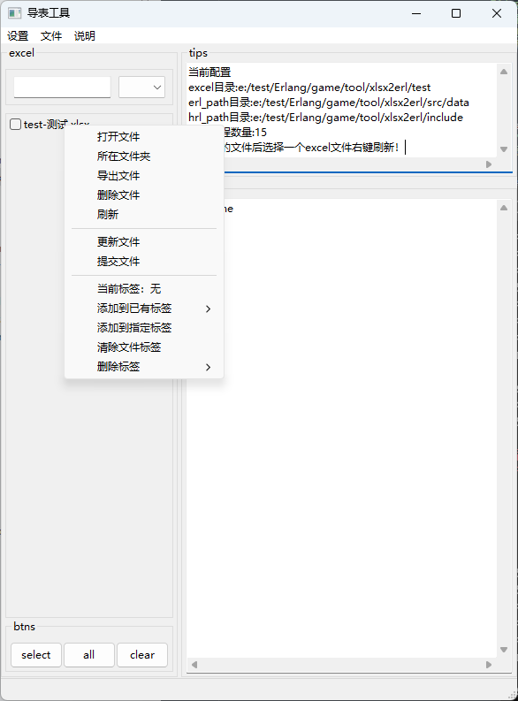

xlsx2erl
=====

将满足一定格式的excel表格转换成erlang的配置表（学习wxwidgets练手项目）

如果觉得对你有帮助，请给我颗小星星吧！

效果图:

Build
-----

    ./rebar3 compile

Run
-----
    ./rebar3 shell --config ./config/xlsx2erl.confg

Config配置说明：
-----
    [
        {
            xlsx2erl, [
                {header_def, [
                    {1, comment,        string}
                    ,{2, name,          atom}
                    ,{3, data_type,     atom}
                    ,{4, is_key,        int}
                    ,{5, export_erl,    int}
                    ,{6, erl_funs,      list} 
                    ,{7, data_begin,    null}
                ]}
                ,{mod, [
                    {export_erl, erl_funs, xlsx2erl_write, [erl_path, hrl_path]}
                ]}
            ]
        }
    ].    

    {header_def, [{行数，标识， 数据类型（该行的数据类型）}]}
    
        第一行： 配置表字段注释，数据类型为string
        第二行： 配置表字段名，数据类型为atom，
        第三行： 配置表字段对应的数据类型（该列的数据类型），数据类型为atom
        第四行： 配置表的主键字段标识，1为主键，0或者不填表示普通字段
        第五行： 是否导出erlang文件标识，0否1是，默认是1
        第六行： erlang文件生成特殊函数，格式：[{FunName, ArgList, ReturnList},...] ArgList: [字段名1,字段名2...] ReturnList: [字段名1,字段名2...]
        第七行： 数据开始标识
    
        注意：comment name data_type is_key data_begin这些标识不可以缺失，不管你的行数是多少行但是这些数据必须要有
        数据读取以空行结束，数据中间不能有任何空行
    
    {mod, []} 定义不同导出规则，以及对应的回调模块
    
    {export_erl, erl_funs, xlsx2erl_write, [erl_path, hrl_path]}
    export_erl：对应header_def中的标识，表示由这个字段控制是否导出erlang配置，可以自由定义
    erl_funs：对应导出规则中的特殊生成规则（函数）
    xlsx2erl_write：回调模块，由xlsx2erl_write模块控制生成erlang配置
    [erl_path, hrl_path]：生成文件存放路径key，ui模块读取这个列表生成按钮设置存放路径，具体使用规则由回调模块定义

